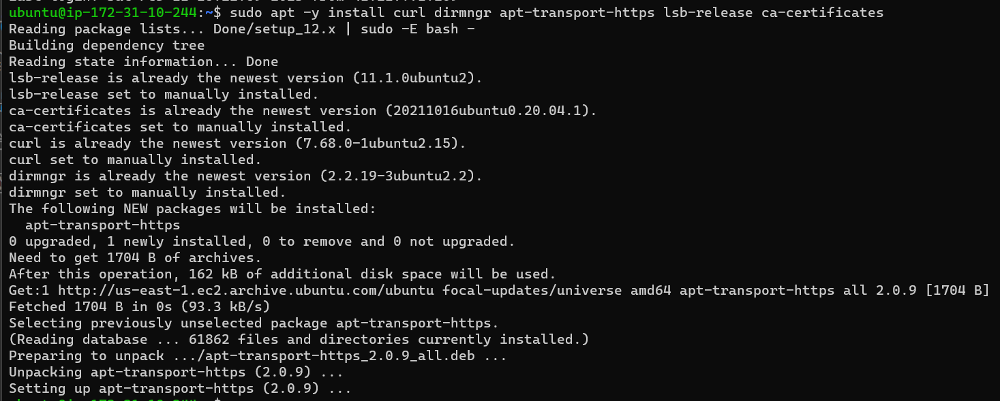
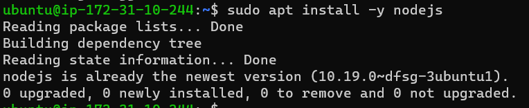
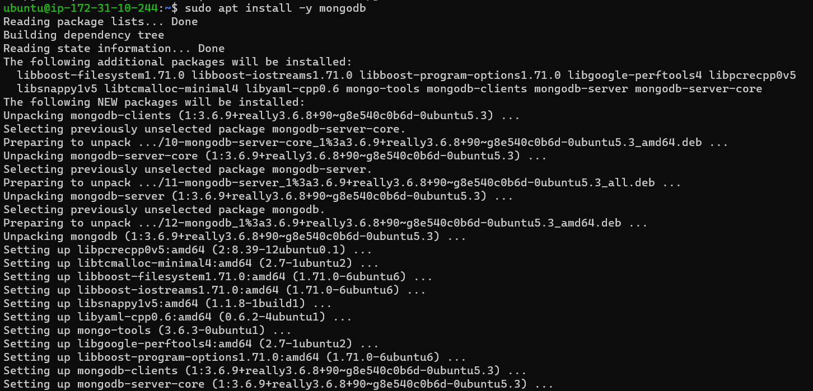
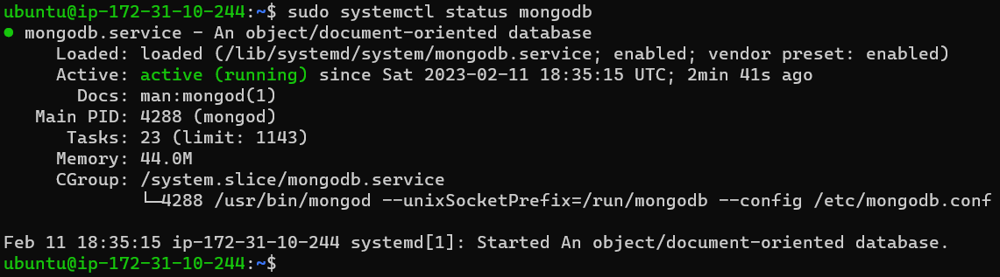
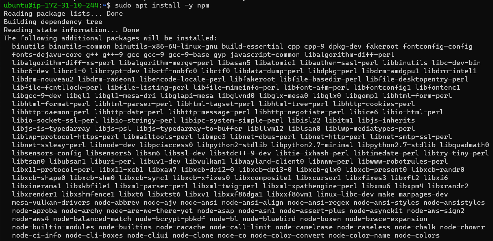
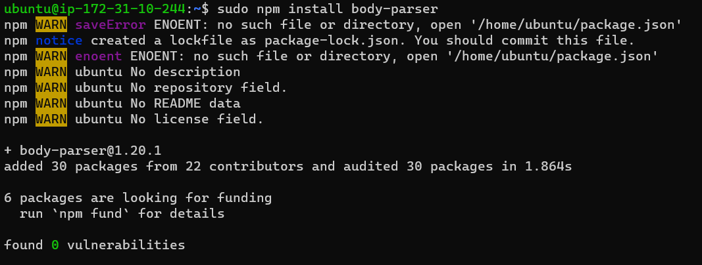
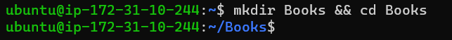
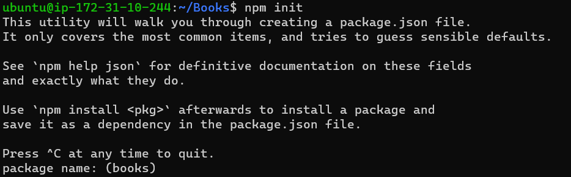
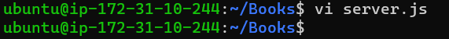
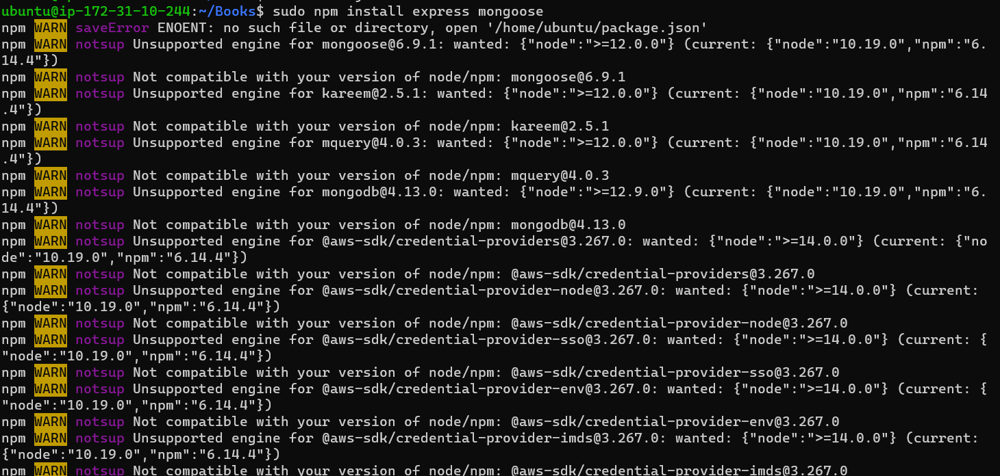

# MEAN STACK DEPLOYMENT TO UBUNTU IN AWS

## Step 1: Install NodeJs

### Update Ubuntu

`sudo apt update`

### Upgrade ubuntu

`sudo apt upgrade`

### Add Certificates

`sudo apt -y install curl dirmngr apt-transport-https lsb-release ca-certificates`

`curl -sL https://deb.nodesource.com/setup_12.x | sudo -E bash -`

### Install NodeJS

`sudo apt install -y nodejs`

## Step 2: Install MongoDB

`sudo apt install -y mongodb`

### Starting The server

`sudo service mongodb start`

To verify that the service is up and running

`sudo systemctl status mongodb`

### Install npm – Node package manager.

`sudo apt install -y npm`

### Installing body-parser package. I need ‘body-parser’ package to help process JSON files passed in requests to the server.

`sudo npm install body-parser`

### Creating a folder named ‘Books’

`mkdir Books && cd Books`

### Iniliazing npm project In the Books directory

`npm init`

### Adding a file to it named server.js

`vi server.js`

### Copy and paste the web server code below into the server.js file

`var express = require('express');
var bodyParser = require('body-parser');
var app = express();
app.use(express.static(__dirname + '/public'));
app.use(bodyParser.json());
require('./apps/routes')(app);
app.set('port', 3300);
app.listen(app.get('port'), function() {
    console.log('Server up: http://localhost:' + app.get('port'));
});`

# INSTALLING EXPRESS AND SETTING UP ROUTES TO THE SERVER

## Step 3: Install Express and set up routes to the server

### Express is a minimal and flexible Node.js web application framework that provides features for web and mobile applications. I will use Express in to pass book information to and from the MongoDB database.

### I will also use Mongoose package which provides a straight-forward, schema-based solution to model my application data. I will use Mongoose to establish a schema for the database to store the data of the book register.

`sudo npm install express mongoose`

